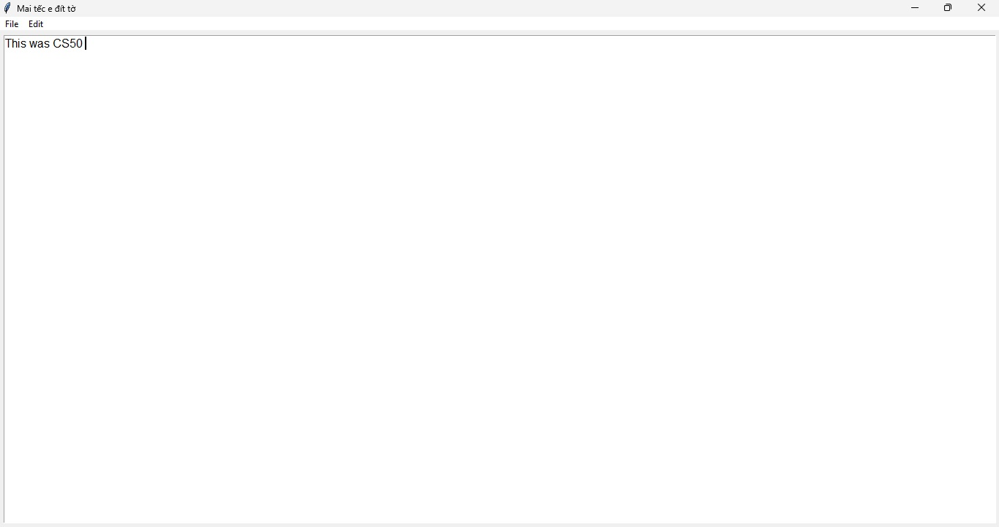
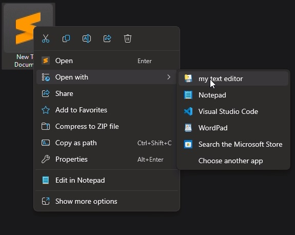

# MY TEXT EDITOR
#### Video Demo:  <URL HERE>
#### Description: my personal text editor
## Overview:
This project is a simple text editor application built using Python and the Tkinter library. It provides basic text editing features such as creating new files, opening existing files, saving files, cutting, copying, and pasting text, selecting all text, and indenting text. Additionally, it supports keyboard shortcuts for common tasks.  
Automatically register applications to open files on windows when open.  
Can runs without python installed.  
Users can adjust the text area size by resizing the main window to suit their preferences and customize the font of the text area to improve readability.  

## Components Explanation:
#### Main Window:

The main window of the application contains a text area where users can input and edit text.  
#### File Menu:

New: Clears the text area, allowing the user to start a new document.  
Open: Opens a file dialog window for the user to select an existing text file to open.  
Save: Saves the current document. If the document has not been saved before, it prompts the user to specify a file name and location.  
Save As...: Allows the user to specify a file name and location to save the current document.  
Exit: Closes the application.  

#### Edit Menu:

Undo: Undoes the last edit action.  
Redo: Redoes the last undone action.  
Cut: Cuts the selected text and places it on the clipboard.  
Copy: Copies the selected text to the clipboard.  
Paste: Pastes the text from the clipboard into the text area.  
Select All: Selects all text in the text area.  
   

#### Building the Application:
To build the application, Python, Tkinter library and pyinstaller are used. The code is organized into a class named SimpleTextEditor, which handles the main functionality of the application. The application is launched by creating an instance of this class and calling the mainloop() method.  

#### Weaknesses:
Lack of Advanced Features: The software lacks advanced features found in more robust text editors, such as syntax highlighting, plugin support, and advanced search functionalities. This makes it less suitable for programming and other specialized tasks.  
  
Limited File Support: It primarily supports plain text files. Users needing to work with other file formats (e.g., Rich Text Format, Markdown, or code files) might find this limiting.  
  
No Built-in Spell Check: The software does not include spell check functionality, which is a common feature in modern text editors. Users might need to rely on external tools for this purpose.  
  
Basic Error Handling: Error handling is quite basic. If a file operation fails, the software may not provide detailed feedback to the user.  
Non-Scalable for Large Projects: The software is not designed for handling large documents or complex projects. For instance, it might struggle with performance when dealing with very large text files.  
  
A bit..... slow:(( : This application is written in python( may not suitable for writing applications) and automatically register applications to open files on windows. So every time you open the app, it will automatically register again.  
  

## Conclusion:
Overall, this software provides a straightforward and user-friendly interface for basic text editing tasks. It is lightweight, easy to use.

## Screenshots:

## Authors

- **Chicanancom** - [Chicanancom](https://github.com/chicanancom)
